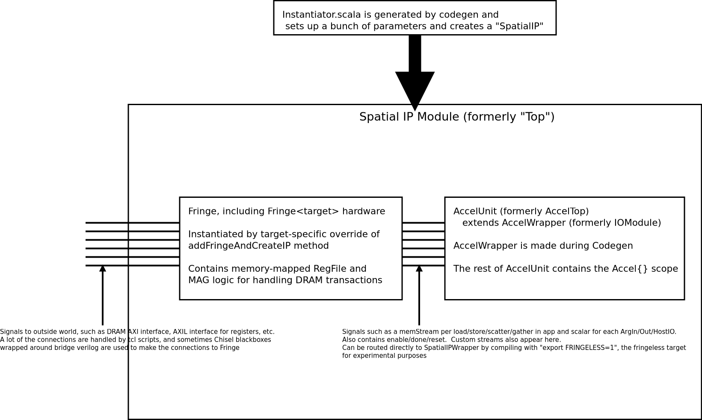

# How to add a new FPGA Target

This guide will teach you how to add a new target to Spatial.  As of now (Oct 2019), Spatial supports the following:
* Xilinx Targets
    * Zedboard
    * ZC706
    * ZCU102
    * Amazon AWS F1 Instances
    * Euresys QuadCXP (~70% of the Kintex Ultrascale XCKU035 is available)
    * KCU1500 (Depends on github.com/slaclab/timetool-spatial. i.e. SLAC Rogue/SURF/Ruckus framework)
* Altera Targets
    * DE1SoC (Terasic board using Cyclone V)
    * Arria10 SoC

# Things You Will Need to Edit
To add a new backend for $TARGET, you need to touch the following places:
* spatial/resources/synth/ - This contains all of the stuff required after the Spatial compiler gives you the Chisel
 and host code for your design.  
    * $TARGET.Makefile - top level makefile for your target
    * $TARGET.hw-resources - hardware files, including tcl scripts, hdl wrappers, etc.
    * $TARGET.sw-resources - software files, including software header files for the host-HW interface (i.e. poke/peek registers).
    This may also contain a software-specific Makefile called by the top-level $TARGET.Makefile
* spatial/resources/models - Area and latency models for the target
    * $TARGET_Latency.csv - Latency models for Spatial IR nodes.  Just copy the ZCU_Latency.scala to get started, unless
    if you really know what you are doing and know exactly what latency equations you want for IR nodes
    * $TARGET_Area.csv - (Deprecated) Area models for Spatial IR nodes.  
* spatial/src/spatial/targets/ - Code that assures the Spatial compiler that your target is a real thing
    * $VENDOR/$TARGET.scala - File that extends HardwareTarget and sets specific details about that target, such as DRAM burst width,
    resource limits (for DSE), and details about the host system (i.e. cpp vs surf host)
    * package.scala - Just add a lazy val for your target
* spatial/src/spatial/codegen/ - Codegen rules for various backends.  You may need to make edits in various 
places here to emit target specific code
    * ${HOSTLANG}gen/${HOSTLANG}Codegen.scala - Generally, while emitting the host backend, all of the relevent files and
    folders in spatial/resources/synth/* get copied over to the generated dir.  You will have to add the rules for your own
    backend here (copyDependencies method)
* spatial/fringe/src/fringe/targets/
    * $TARGET/BigIP$TARGET.scala - Contains a bunch of chisel wrappers around the black boxes you want to use for certain IPs,
    such as arithmetic boxes
    * $TARGET/Fringe$TARGET.scala - If you need to have additional junk inside of fringe, you can put it here and instantiate it
    and have Fringe just be a module inside this larger one.
    * $TARGET/$TARGET.scala - Place where you override addFringeAndCreateIP to actually create Fringe and return the SpatialIP interface
    for the outside world

Over time, we moved a lot of the boilerplate scala from being manually emitted during codegen to being part of the Fringe package.
This means that you need to publish the fringe package (use export FRINGE_PACKAGE=\<something\> to force it to rely
on your edited fringe package instead of fetching the latest from .ivy2 or the web).
This also means it is a confusing to work with various backends.  Don't worry, its not you, its just a confusing 
project structure.  The general system diagram of a "SpatialIP," which is the final SpatialIP.v file that gets generated
after building hw looks like this:

